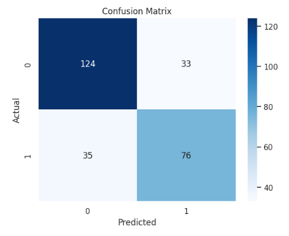
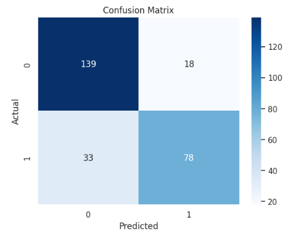
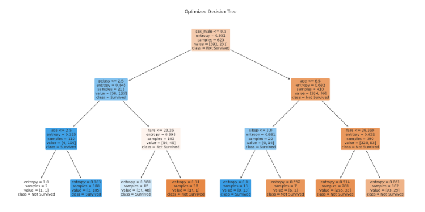
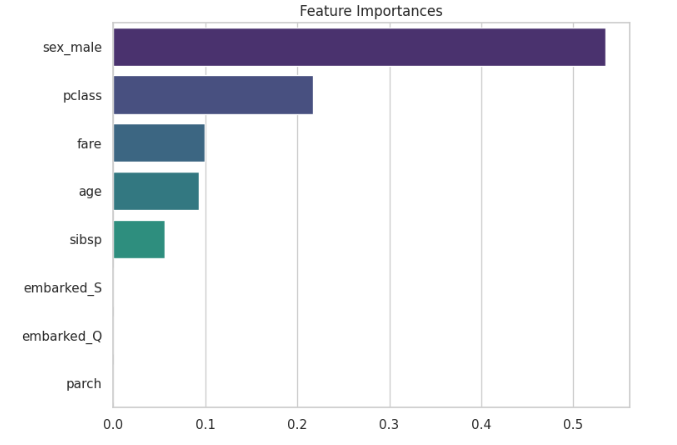

# Decision Trees: Titanic Survival Prediction  [](https://www.python.org/) [](https://scikit-learn.org/stable/) [](https://seaborn.pydata.org/) [](./LICENSE) [](https://jupyter.org/) [](https://www.kaggle.com/code/evangelosgakias/decision-trees) [](https://www.kaggle.com/code/evangelosgakias/decision-trees)

---

## 🚀 Live Results

You can view the notebook with all outputs and results on Kaggle:
[https://www.kaggle.com/code/evangelosgakias/decision-trees](https://www.kaggle.com/code/evangelosgakias/decision-trees)

All metrics, plots, and outputs are available in the linked Kaggle notebook for full transparency and reproducibility.

---

## 📑 Table of Contents
- [Live Results](#-live-results)
- [Table of Contents](#-table-of-contents)
- [Overview](#-overview)
- [Project Structure](#-project-structure)
- [Features](#-features)
- [Quickstart](#-quickstart)
- [Usage](#-usage)
- [Results](#-results)
- [Limitations and Future Work](#-limitations-and-future-work)
- [Contributing](#-contributing)
- [License](#-license)
- [Contact](#-contact)

---

## 📝 Overview

This project demonstrates a complete machine learning workflow for predicting Titanic passenger survival using **Decision Trees**. The notebook covers:
- End-to-end data science best practices (EDA, preprocessing, modeling, evaluation, and interpretation)
- Professional documentation, accessibility, and reproducibility standards

**Goal:** Predict whether a Titanic passenger survived based on demographic and ticket information. This project is ideal for showcasing classification analysis, model interpretability, and data storytelling.

---

## 🏗️ Project Structure

```
Decision Trees/
├── decision_trees.ipynb   # Jupyter notebook with the complete implementation
├── README.md              # Project documentation (this file)
├── requirements.txt       # Python dependencies
├── LICENSE                # MIT License file
├── figure/                # Folder containing all result plots and visualizations
└── .venv/                 # (Optional) Virtual environment directory
```

---

## 🚀 Features

### Data Preparation
- **Dataset Loading:** Uses the Seaborn Titanic dataset (multiple features, 891 samples)
- **Exploratory Data Analysis (EDA):** Statistical summaries, visualizations (histograms, count plots)
- **Preprocessing:**
  - Handling missing values (median/mode imputation)
  - Categorical encoding (one-hot/dummy variables)
  - Train/test split (70%/30%)

### Modeling
- **Decision Tree Classifier:**
  - scikit-learn implementation
  - Model interpretability via tree visualization and feature importances
  - Hyperparameter tuning (GridSearchCV)

### Evaluation & Interpretation
- **Metrics:** Accuracy, Precision, Recall, F1-Score
- **Visualizations:**
  - Confusion matrix
  - Decision tree plot
  - Feature importance bar chart

*All plots include descriptive titles, axis labels, and are designed for accessibility.*

---

## ⚡ Quickstart

1. **Kaggle (Recommended for Reproducibility):**
   - [Run the notebook on Kaggle](https://www.kaggle.com/code/evangelosgakias/decision-trees)
2. **Local:**
   - Clone the repo and run `decision_trees.ipynb` in Jupyter after installing requirements.

---

## 💻 Usage

1. **📥 Clone the repository:**
   ```bash
   git clone https://github.com/EvanGks/decision-trees-titanic.git
   cd decision-trees-titanic
   ```
2. **🔒 Create and activate a virtual environment:**
   - **Windows:**
     ```bash
     python -m venv .venv
     .venv\Scripts\activate
     ```
   - **macOS/Linux:**
     ```bash
     python3 -m venv .venv
     source .venv/bin/activate
     ```
3. **📦 Install dependencies:**
   ```bash
   pip install -r requirements.txt
   ```
4. **🚀 Launch Jupyter Notebook:**
   ```bash
   jupyter notebook decision_trees.ipynb
   ```
5. **▶️ Run all cells** to reproduce the analysis and results.

**🛠️ Troubleshooting:**
- If you encounter missing package errors, ensure your Python environment is activated and up to date.
- For best reproducibility, use the provided Kaggle link.

---

## 📊 Results

### Model Metrics

- **Initial Decision Tree Model:**
  - **Accuracy:** 0.746
  - **Classification Report:**

    | Class | Precision | Recall | F1-score | Support |
    |-------|-----------|--------|----------|---------|
    | 0     | 0.78      | 0.79   | 0.78     | 157     |
    | 1     | 0.70      | 0.68   | 0.69     | 111     |
    | **accuracy** |        |        | 0.75     | 268     |
    | **macro avg** | 0.74   | 0.74   | 0.74     | 268     |
    | **weighted avg** | 0.75 | 0.75   | 0.75     | 268     |

- **Best Model (after GridSearchCV hyperparameter tuning):**
  - **Best Parameters:** `{'criterion': 'entropy', 'max_depth': 3, 'min_samples_split': 2}`
  - **Best Cross-Validation Accuracy:** 0.811
  - **Test Accuracy:** 0.810
  - **Classification Report:**

    | Class | Precision | Recall | F1-score | Support |
    |-------|-----------|--------|----------|---------|
    | 0     | 0.81      | 0.89   | 0.84     | 157     |
    | 1     | 0.81      | 0.70   | 0.75     | 111     |
    | **accuracy** |        |        | 0.81     | 268     |
    | **macro avg** | 0.81   | 0.79   | 0.80     | 268     |
    | **weighted avg** | 0.81 | 0.81   | 0.81     | 268     |

### Visualizations

Below are key result plots generated by the project (see the [`/figures`](./figures) directory for all images):

| Visualization | Description |
|---------------|-------------|
|  | *Confusion matrix for the initial Decision Tree model* |
|  | *Confusion matrix for the best (tuned) Decision Tree model* |
|  | *Visualization of the optimized Decision Tree structure* |
|  | *Feature importances as determined by the best model* |

*All plots include descriptive titles, axis labels, and alt text for accessibility. See the `/figures` folder for additional details and high-resolution images.*

---

## 📝 Limitations and Future Work

- **Overfitting:** Decision Trees can overfit if not properly tuned
- **Feature Engineering:** More advanced features could improve performance
- **Model Comparison:** Try ensemble methods (Random Forest, Gradient Boosting) for better results
- **Cross-Validation:** Employ for more robust evaluation
- **Deployment:** Consider deploying as a web app for interactive exploration

---

## 🤝 Contributing

Contributions are welcome! Please feel free to submit a Pull Request. For major changes, open an issue first to discuss what you would like to change.

---

## 📝 License

This project is licensed under the MIT License. See the [LICENSE](./LICENSE) file for details.

---

## 📬 Contact

For questions or feedback, please reach out via:
- **GitHub:** [EvanGks](https://github.com/EvanGks)
- **X (Twitter):** [@Evan6471133782](https://x.com/Evan6471133782)
- **LinkedIn:** [Evangelos Gakias](https://www.linkedin.com/in/evangelos-gakias-346a9072)
- **Kaggle:** [evangelosgakias](https://www.kaggle.com/evangelosgakias)
- **Email:** [evangks88@gmail.com](mailto:evangks88@gmail.com)
---

Happy Coding! 🚢
